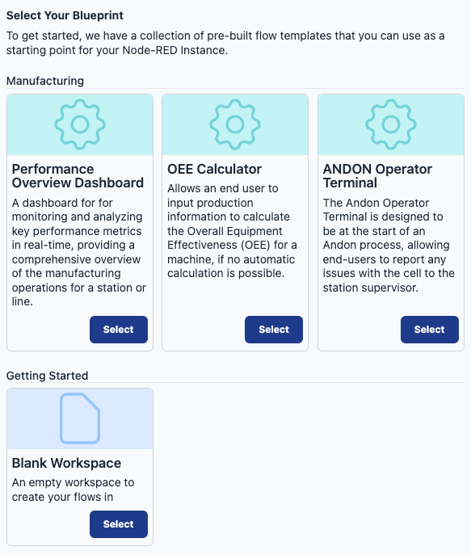

We have updated the blueprint selection interface to enhance the user experience by offering a clearer and more comprehensive overview. This improvement aims to facilitate easier navigation and selection of blueprints. Additionally, we are excited to announce that our blueprint library will be expanding in the coming days, with the addition of new blueprints to FlowFuse.

For more detailed information about our blueprints and how to utilize them effectively, please refer to our dedicated [article](/blog/2023/10/blueprints/).