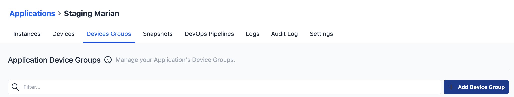
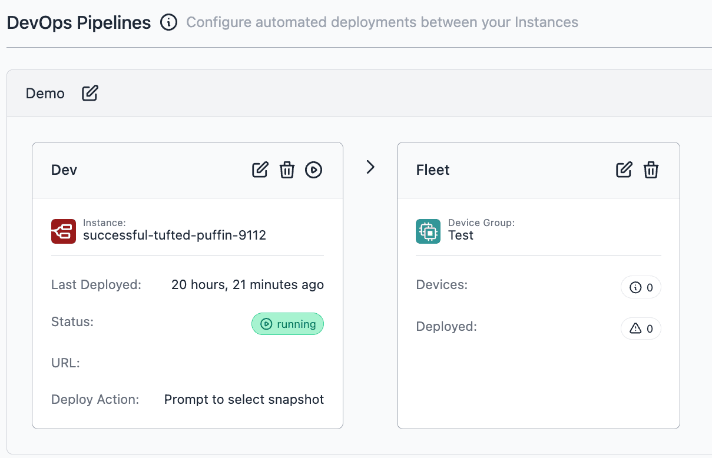

We are pleased to announce the introduction of Device Groups for Enterprise Tier customers. This new feature enables users to logically group their devices assigned to an application. Additionally, Device Groups can be integrated into the DevOps Pipeline. This integration facilitates more streamlined and efficient deployments across your fleet of devices.

