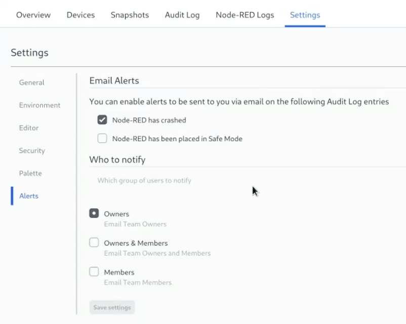

::note
Exciting Update! FlowFuse is now available as three different products: [FlowFuse Edge for OT teams](https://flowfuse.com/product/edge/), [FlowFuse Hub for IT teams](https://flowfuse.com/product/hub/), and [FlowFuse Fleet](https://flowfuse.com/product/fleet/) for managing devices at scale. Visit the [FlowFuse Product Page](https://flowfuse.com/product/) to learn how the platform enables you to build and manage industrial apps at scale.
::

The newly introduced feature offers email notifications tied to particular Audit log events, available to all users with Pro Tier access or higher. This feature is designed to facilitate immediate notification and action in response to  Node-RED Instance crashes. For detailed information and guidance on this functionality, please refer to our [documentation](/docs/user/instance-settings/#alerts).

