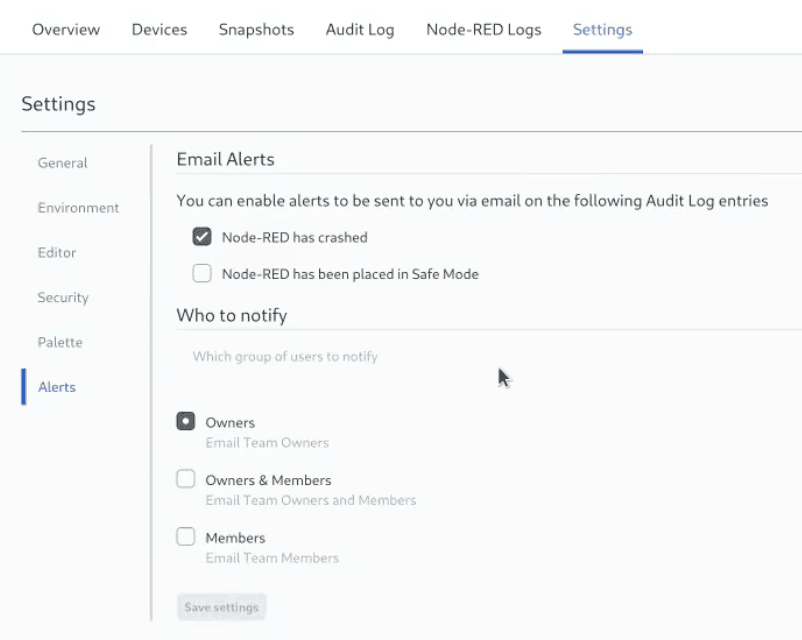

The newly introduced feature offers email notifications tied to particular Audit log events, available to all users with Pro Tier access or higher. This feature is designed to facilitate immediate notification and action in response to  Node-RED Instance crashes. For detailed information and guidance on this functionality, please refer to our [documentation](/docs/user/instance-settings/#alerts).

