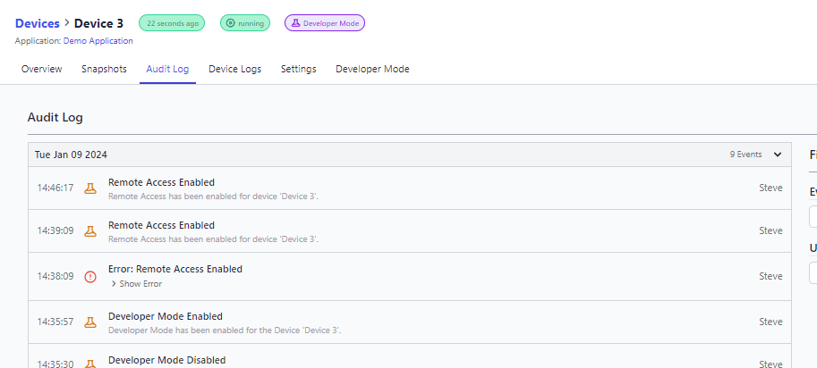

The introduction of the Device Auditlog brings an enhanced level of monitoring and tracking for device-related activities, available to all FlowFuse users.

Events Recorded in the Device Auditlog:

- Fleet mode / Developer mode enabled/disabled
- Remote access enabled/disabled
- Credentials re-generated
- Device assigned

