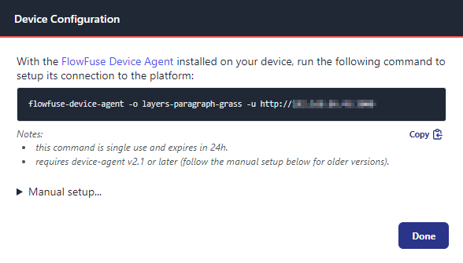
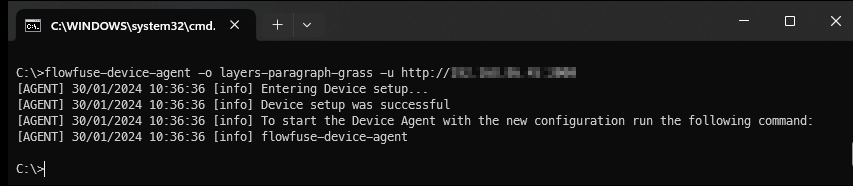

Hot on the heals of our recent onboarding improvements and streamlining, we 
have now introduced a new simpler and faster way of getting your devices
configured and connected to the FlowFuse platform.

Now, when you create a device on the platform, you will be offered a simple
"Quick Connect" command. Run this command in a terminal or command windows
and the let the device agent do all the hard work for you.

