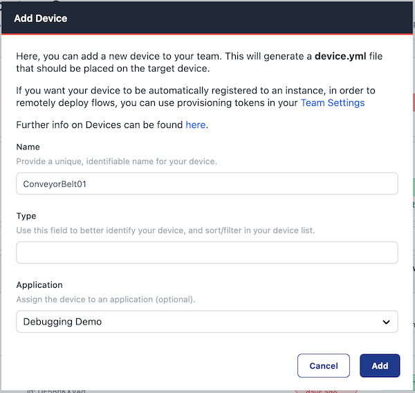

To start editing flows on a device, it needs to be assigned to an application
in your team. Up until now this has been a two step process; creating the device
and then assigning it. This wasn't as intuitive as it needed to be.

To help streamline the user experience, you can now assign a device to an application
when you create it. It's a small update, but it helps users get to where they want
to be much quicker.

