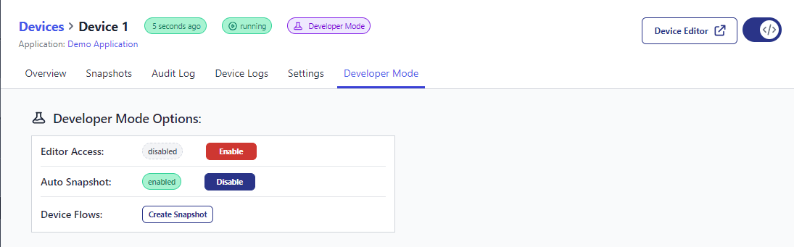

FlowFuse V2.1 introduces Auto Snapshots for your Application Assigned Devices.

When you deploy a change to the device flows, a snapshot will be taken automatically.

The last 10 Auto Snapshots will be kept on a first in first out bases. Older Auto Snapshots will be automatically cleaned up for you.

Click the following links to learn more about [devices](https://flowfuse.com/docs/device-agent/) and [snapshots](https://flowfuse.com/docs/user/snapshots/#snapshots).
