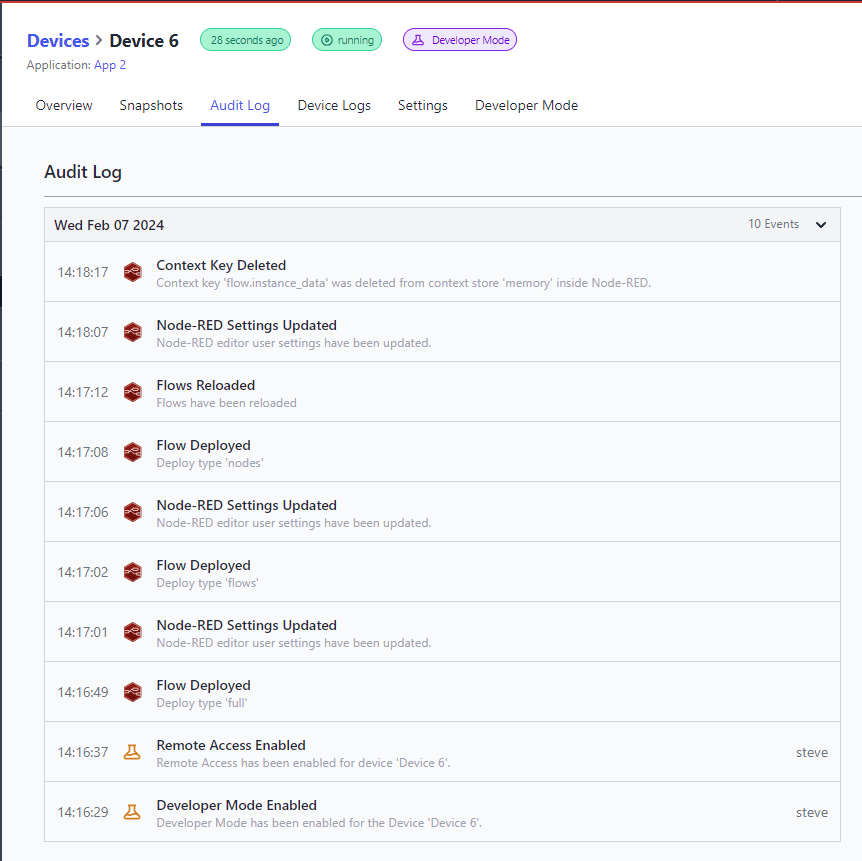

With the introduction of the Device Auditlog last month, now we collect and display the logging events from the Node-RED instance running on your device.

This brings closer parity with the logging you get from a hosted instance.

Additional Events Recorded in the Device Auditlog include:

- Context Key Deleted
- Node-RED Settings Updated
- Flows Reloaded
- Flow Deployed
- Nodes Installed
- Nodes Removed
- Library Item Saved

