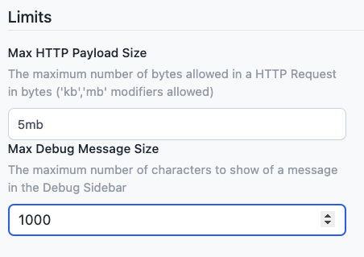

We've introduced new configuration options to enhance the control of your HTTP requests and debugging process. These updates allow you to configure limits on the sizes of HTTP messages and debug messages in the editor. This feature is available to all our Teams and Enterprise Tier customers. You can access these new configuration options in the Instance Settings under the "Editor" menu.

