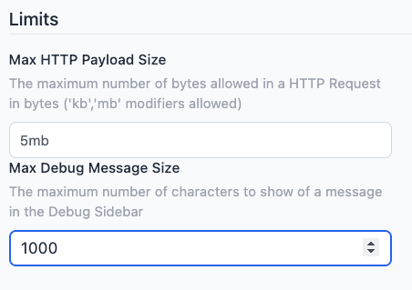

We've introduced new configuration options to enhance the control of your HTTP requests and debugging process. These updates allow you to configure limits on the sizes of incoming HTTP messages and how many characters of a message are included in debug messages in the editor sidebar.

This feature is available to all our Teams and Enterprise Tier customers. You can access these new configuration options in the Instance Settings under the "Editor" menu.

