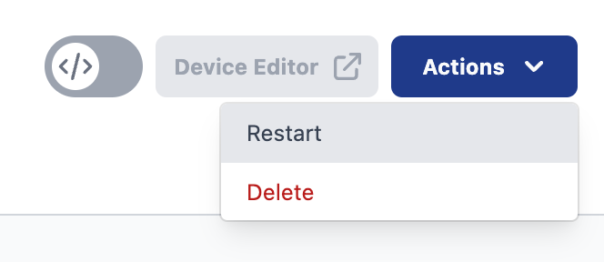

The latest version of the FlowFuse device agent now supports remotely restarting your Node-RED flows from the FlowFuse platform. This brings it more inline with what the platform lets you do with your hosted Node-RED instances.

This removes the need to manually connect to your device to restart Node-RED, streamlining your workflow and offering a more seamless and efficient user experience.

