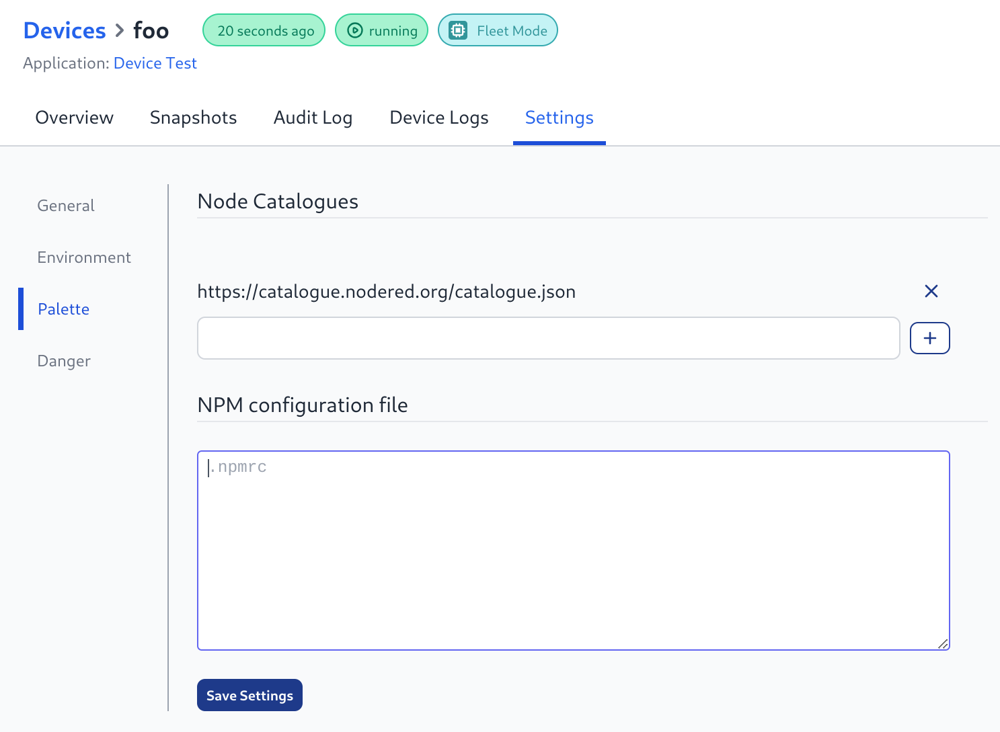

We have supported the ability to configure your Node-RED instances with [custom node catalogues](/changelog/2023/09/custom-node-support/) for some time now. This feature allows you to access alternative NPM registries to use nodes that have not been made publicly available.

We have now extended this to work with your Node-RED devices, giving them the same ability to access private node catalogues, and deploy them across your fleet of devices.

<figcaption>Custom Node Catalog Support for Devices</figcaption>