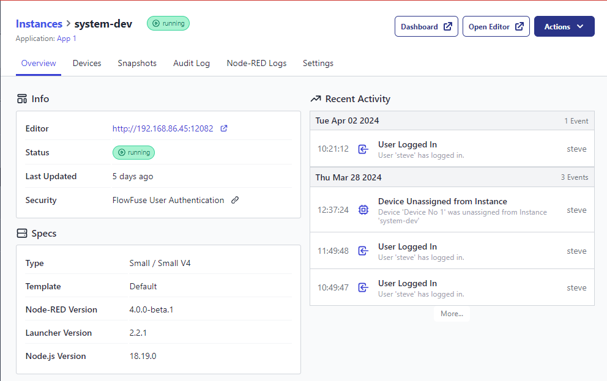

We have added quick access buttons to help you navigate to your Dashboard 2.0 UI in a single click.

_Dashboard button is displayed alongside the Open Editor button when an instance has `@flowfuse/mode-red-dashboard` installed._

Click the link to learn more about [Flowfuse Dashboard 2.0](https://dashboard.flowfuse.com/)
