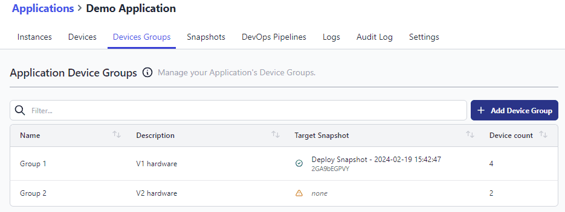
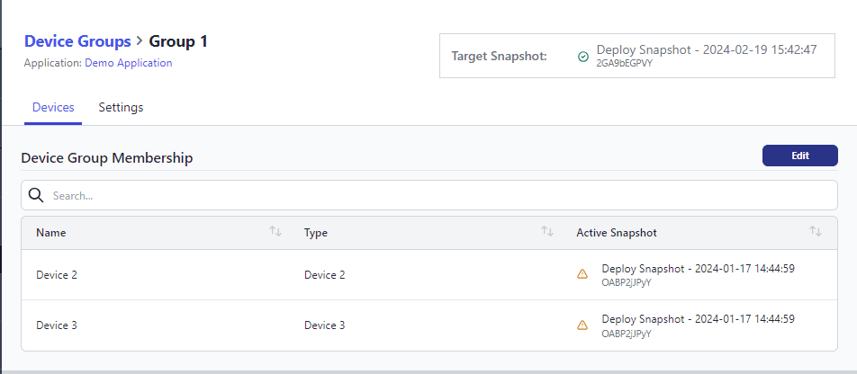

Device Groups make it really simple to deploy a snapshot across multiple devices using our Pipelines feature.
When the pipeline stage is triggered, you can watch as the snapshot is rolled out across all of target devices.

We've updated the Device Group view to include more information about what snapshot is currently deployed to the group, and the deployment status of individual devices in the group.

<figcaption>Summary details of all Device Groups in an application</figcaption>

<figcaption>Details of all devices within a Device Group</figcaption>
