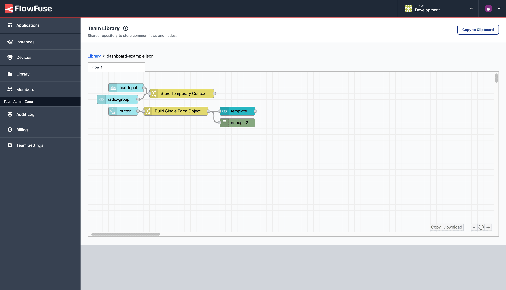

The Library feature allows you to save and share common functionality and flows across your team on FlowFuse. We've just added the ability to preview any flows saved here, making it easier to understand what they do and explore your collections of flows before importing them into your workspace.

This new feature will better help you maintain and manage your team's shared flows, and give better visibility on flows that your fellow Team members are building.

