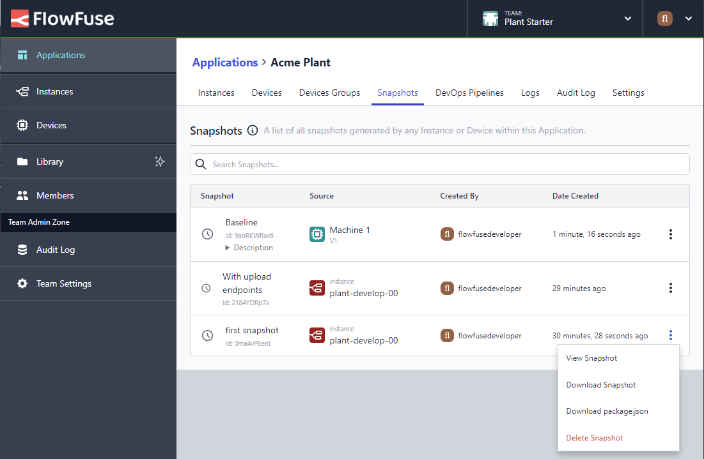

[Snapshots](/docs/user/snapshots/#snapshots) are a point-in-time backup of Node-RED
that can be used to easily revert back to previous version, or to push out to other
instances and devices as part of our Pipelines feature.

Following on from the recent work around snapshots to permit [Instance Snapshot Downloads](/changelog/2024/05/snapshot-improvements) and [Snapshot Uploads](/changelog/2024/05/snapshot-upload),
we have now added the ability to download application device snapshots. 

This means you can download a snapshot from any device or instance and upload it to any
device or instance on any FlowFuse instance.

Also, to improve access to these actions, we have also updated the application
and device snapshot table items menu to present all relevant snapshot actions.

#### Application Snapshots

#### Instance Snapshots

#### Device Snapshots
