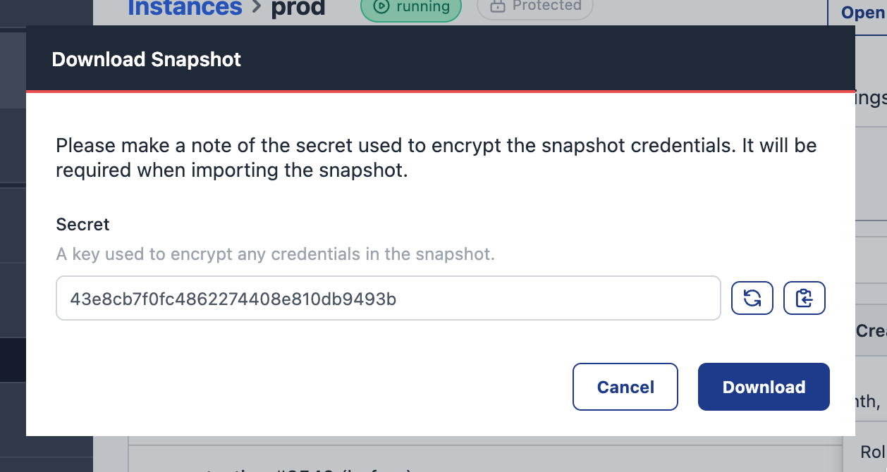

[Snapshots](/docs/user/snapshots/#snapshots) are a point-in-time backup of Node-RED
that can be used to easily revert back to previous version, or to push out to other
instances and devices as part of our Pipelines feature.

We have lots planned to improve the overall workflow with snapshots, and have a couple
updates to share that are available today.

### Viewing snapshot contents

Following the work done to [enable viewing flows in the Team Library](/changelog/2024/05/library-flowviewer), we've added
the same capability to snapshots.

Each snapshot now has a 'View Snapshot' option that will display the flows without having to open up
the full Node-RED editor.

### Downloading snapshots

We've also added the ability to download snapshots locally - allowing you to take
your own offline backups of your flows.

The 'Download Snapshot' option is currently available on Instance Snapshots, but we'll be rolling
it out to all snapshot types in the near future. We are also working on an Import feature
that will let you upload a snapshot back into the platform.

