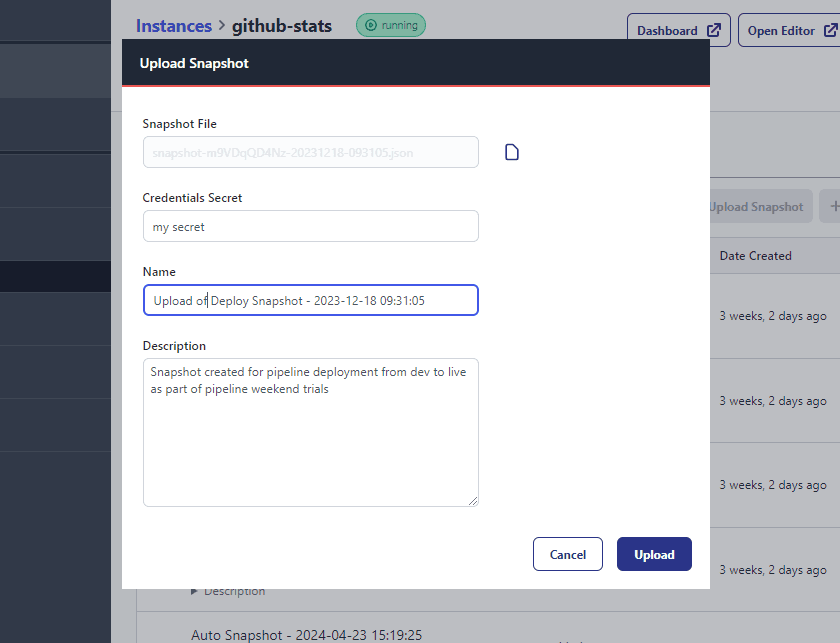

[Snapshots](/docs/user/snapshots/#snapshots) are a point-in-time backup of Node-RED
that can be used to easily revert back to previous version, or to push out to other
instances and devices as part of our Pipelines feature.

As promised we have now provided a way for you to upload your locally downloaded snapshots.

This means you can now easily take a snapshot and move it between FlowFuse platforms or,
if you prefer, automate it via the APIs it is built on.

We hope you like this nifty little feature. 

Stay tuned as we expect the final peices in the overall [Snapshot Improvements](/changelog/2024/05/snapshot-improvements)
to be delivered in the coming days.
