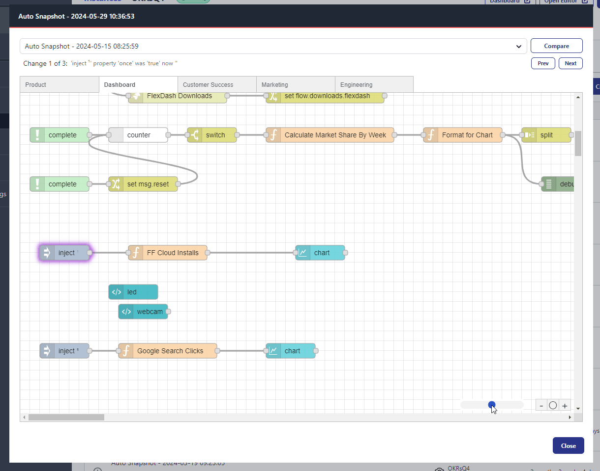

FlowFuse now supports the input of multi-line environment variables for your Node-RED instances running on FlowFuse.

This unlocks the ability to store certs or multi-line values like JSON as environment variables.

We've also improved the `.env` file import to support the use of multi-line values too.

