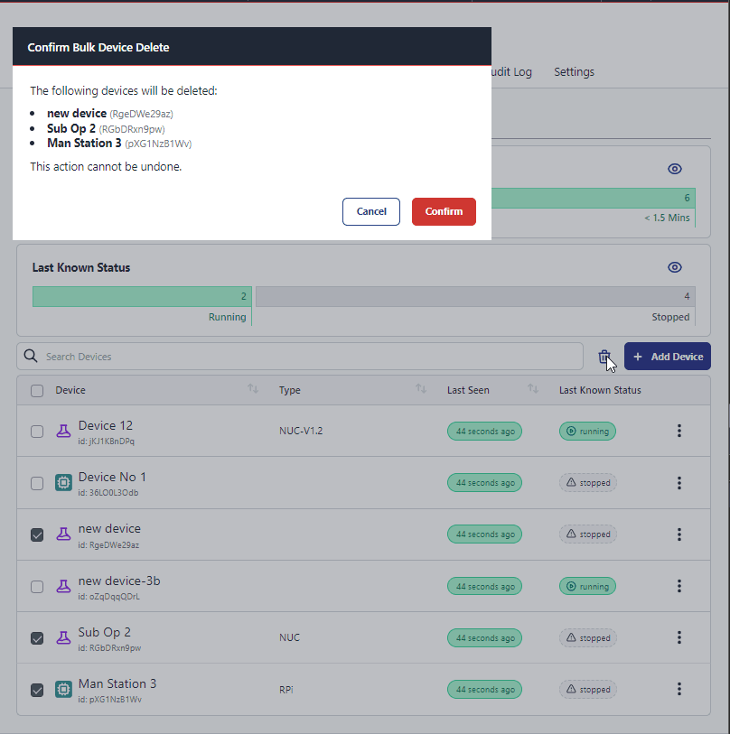

We have added bulk operations for managing devices. 

In this first iteration we have added the ability to delete multiple devices at once.

To use this feature, navigate to the devices page, application devices or instance devices and place a check in the box next to the devices you wish to delete.
Once you have selected the devices you wish to delete, click the trash can button above the table & confirm the deletion.

We will be adding more bulk operations in the future, so keep an eye out for more updates.

