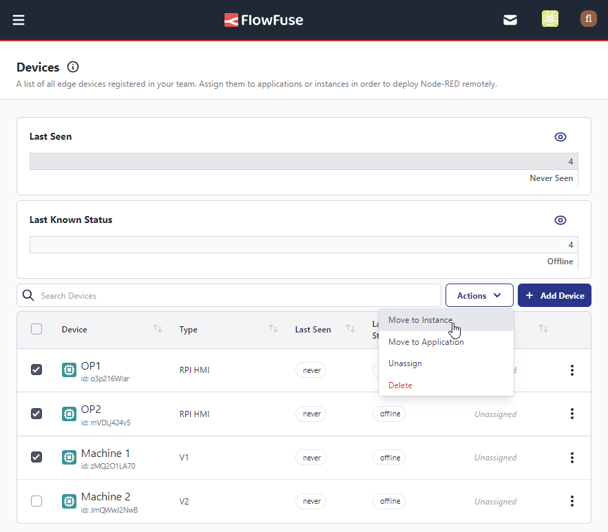
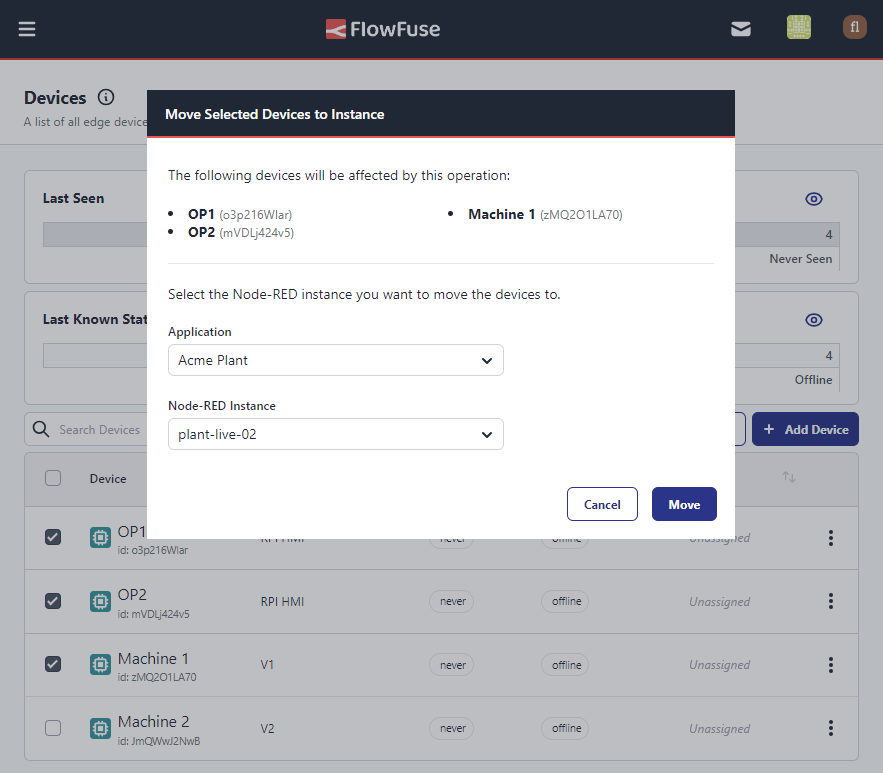

Having recently added the ability to delete multiple devices at once, we have now added the ability to move multiple devices at once.

To use this feature, navigate to the devices page, application devices or instance devices and place a check in the box next to the devices you wish to move.
Once you have selected the devices you wish to move, click the new menu button above the table & select the new location for the devices.

We are are sure this will make managing your devices a good deal easier.

You can read up on the new feature in our [documentation](https://flowfuse.com/docs/device-agent/register/#assign-the-device).
