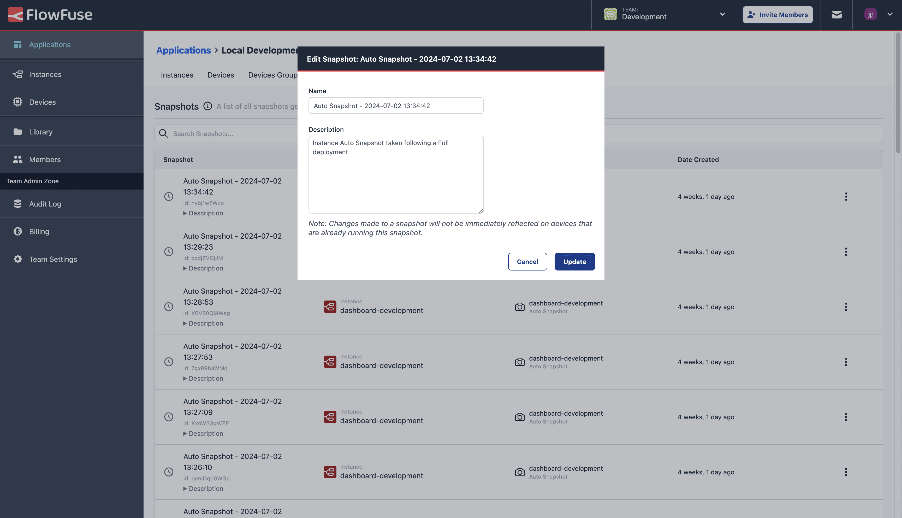

Snapshots can now be renamed and their descriptions updated, even after they're created.

{data-zoomable}
_Screenshot showing the new Edit Snapshots feature in FlowFuse_

This is particularly useful for the snapshots that are automatically generated each time your deploy your flows, making it easier to track back your changes and revert to a previous state if needed.