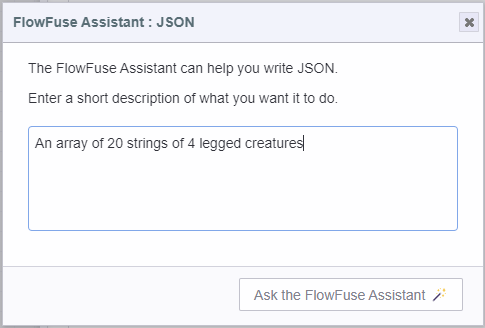
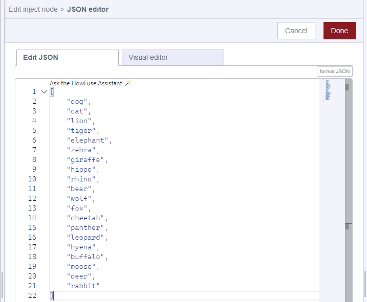
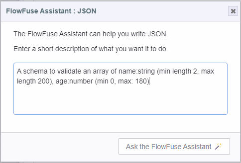
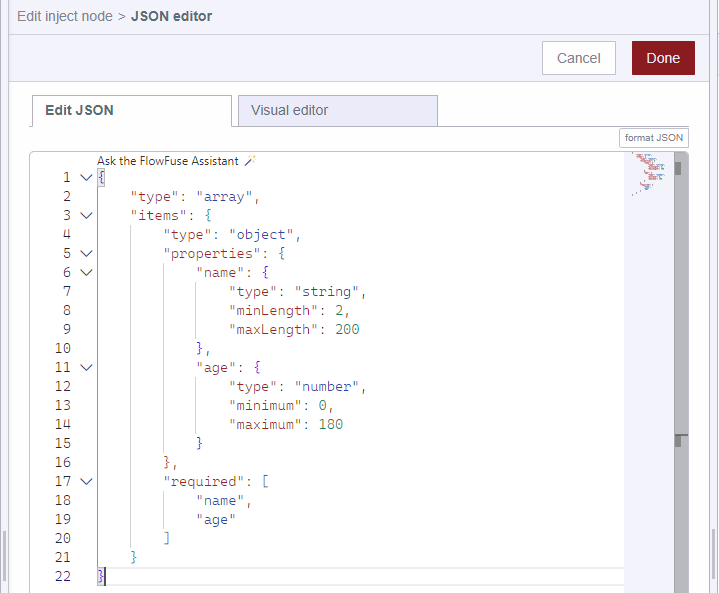
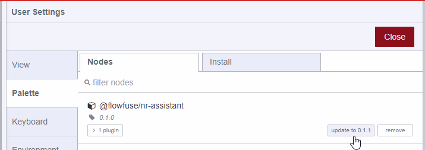
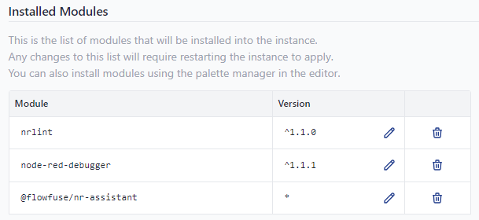

The FlowFuse Expert can now assist you by generating JSON.

Wherever you edit JSON in the Rich Monaco Editor you will see the "Ask the FlowFuse Expert 🪄" code lens.
That includes the Inject Node, the Template Node and any contrib node that uses the built-in editor for writing JSON.

We think you will find this to be a great time saver and a good helper when you are unsure of the syntax.

Just ask for what you want and it does a decent job of figuring it out.

Here are some examples:

### Asking the Assistant to generate JSON from within the `template` node

### Asking the Assistant to generate JSON from within the `inject` node for the `payload` value 

This is just the beginning of the FlowFuse Expert's capabilities. Stay tuned!

#### Updating the Assistant to get these new features
If you are running Node-RED v4.x, head over to the Palette Manager, update the plugin and restart your instance.

If you are still running Node-RED v3.x, you can update the plugin by adding `@flowfuse/nr-assistant` to the instance settings then restart it.

