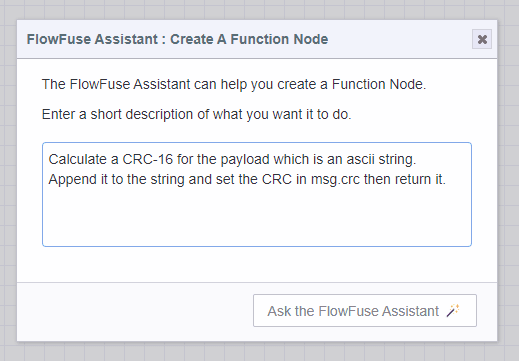

We are excited to announce the first release of The FlowFuse Expert, a new plugin for your Node-RED instances designed to enhance your development experience.

In this initial release, The FlowFuse Expert can help you create function nodes for those times when a no-code solution is either not feasible or not possible.
Additionally, it works directly inside the Function Node editor right where you need it.

This is just the beginning. The FlowFuse Expert will continue to evolve, with future updates bringing even more powerful features and enhancements.

Starting from today, FlowFuse Expert is available on FlowFuse Cloud. Users will need to update their instances to the latest stack to enable it.

