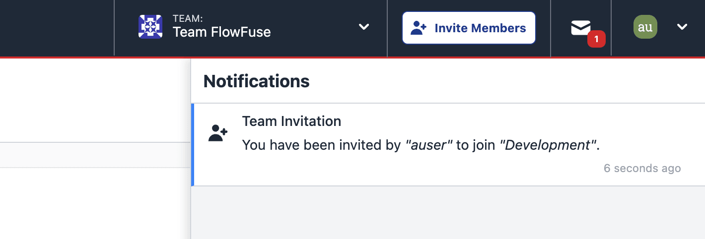

We've made some changes to the way notifications are displayed and handled in FlowFuse to make it easier to see what's going on in your system, with a new, dedicated, "Notifications Inbox".

{data-zoomable}
_Screenshot showing the new Notifications Inbox in FlowFuse_

Whilst the only notifications we're supporting right now are team invites, this groundwork will allow us to expand the types of notifications we can send in the future to give better visibility of what's happening in your FlowFuse environment.