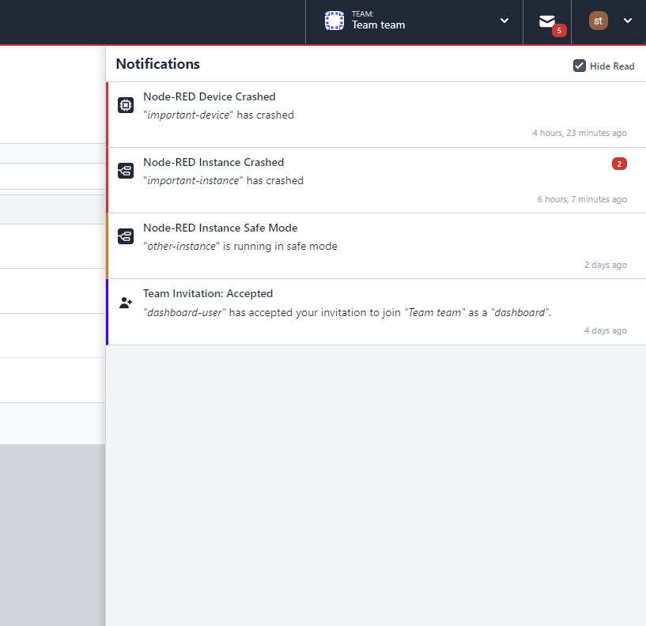
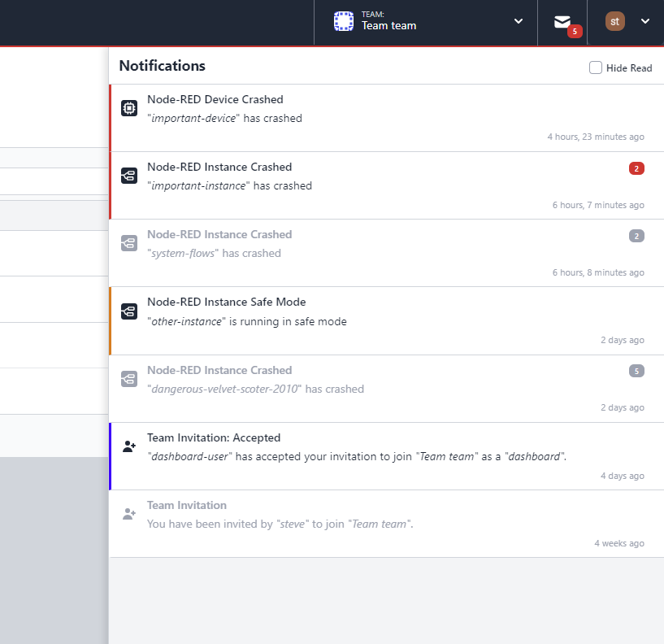

To keep you focused, we have added a "Hide Read" checkbox that is checked by default so that you only see active notifications. 

Not only that, we've added some new notifications so that members and owners get fast feedback for important events in your system.

{data-zoomable}
_Screenshot showing unread Notifications Inbox in FlowFuse_

{data-zoomable}
_Screenshot showing read Notifications Inbox in FlowFuse_
