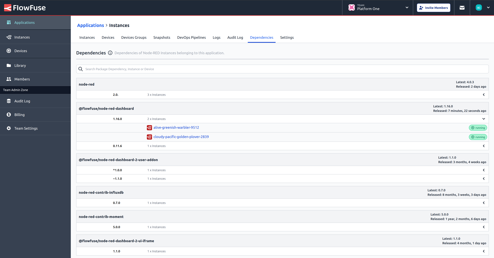

Starting with the v2.9.0 release FlowFuse a new Application Dependencies tab will be available for Enterprise self-hosted 
and Enterprise Tier FlowFuse Cloud users where a complete list of dependencies belonging to every Instance associated to the application can be found.

The intent is to give users a birds eye view of an application's dependencies and track dependency changes. 

Users can search by package name, version, instance or device name.

