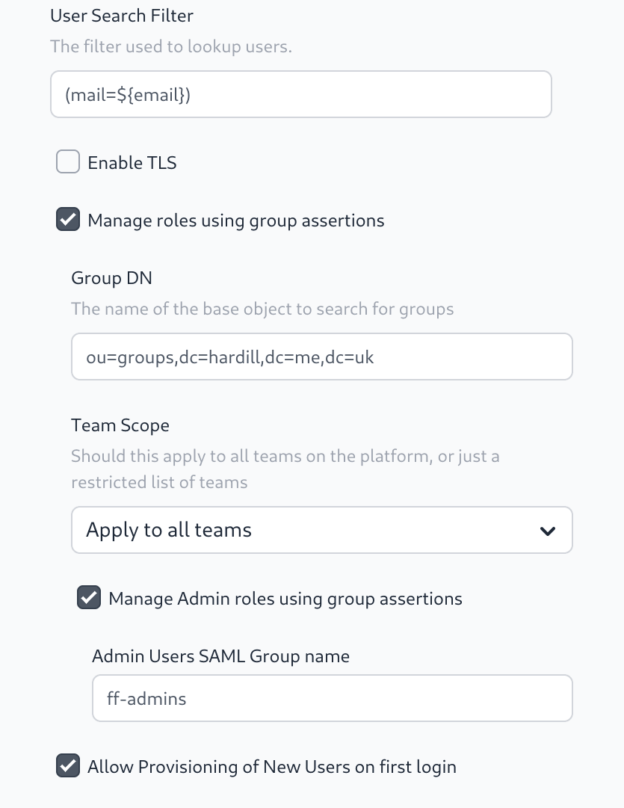

In the v2.8.0 release we have updated the LDAP SSO feature to allow group
membership to be managed by LDAP groups.

## Configuring

Building on the SAML based SSO configuration there is now a `Manage roles using group assertions` check box on the LDAP SSO configuration page. This allows a base LDAP DN for groups to be set. This will used to look up which groups a user is a member of when they login to the platform.

Groups can be `groupOfNames` or `groupOfUniqueNames` and membership will be checked against `memberOf` or `uniqueMemberOf` fields respectively.

### Group Naming

Group names must follow the this pattern `ff-<team slug>-role`

The valid roles for a user in a team are:
 - `owner`
 - `member`
 - `viewer`
 - `dashboard`

 *Note*: this uses the team slug property to identify the team. This has been chosen to simplify managing
the groups in the LDAP Provider - rather than using the team's id. However, a team's slug can be changed
by a team owner. Doing so will break the link between the group and the team membership - so should only
be done with care.

More details can be found in the [SSO LDAP documentation](/docs/admin/sso/ldap).

## Managing FlowFuse Admins

In the previous release we added support for managing FlowFuse Admin users by group membership to SAML SSO, this is now available to LDAP as well.

*Note*: It is advised to maintain a backup admin user that does not 
authenticate via SSO so ensure access can be maintained if the SSO 
provider is unavailable. Also the system will not remove the admin flag 
from a user if that would leave the platform with no admins even if they 
removed from the group.

This feature is only available to FlowFuse self-hosted customers.