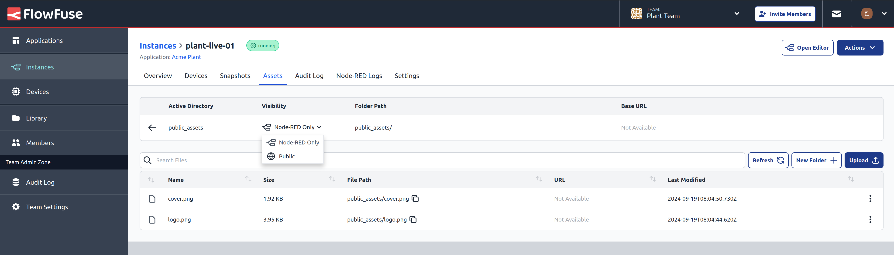
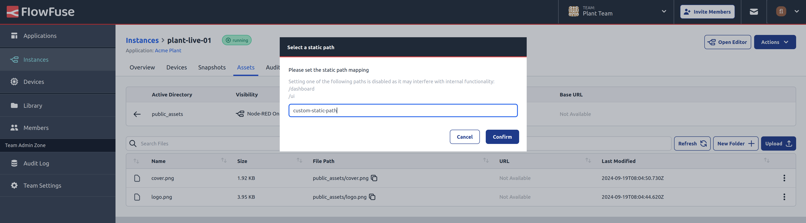
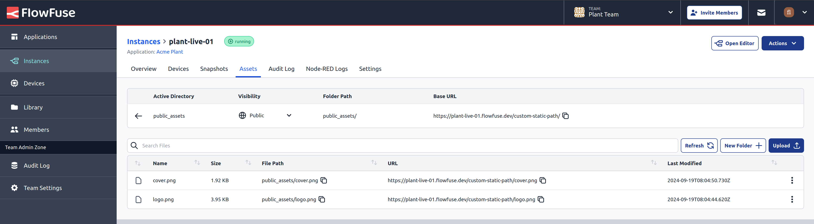

Users of FlowFuse Cloud can now make use of an enhanced navigation tool and visibility selector when using the [static file service feature](https://flowfuse.com/blog/2024/08/flowfuse-2-8-release/#static-assets-service).

By settings the visibility of a folder to 'public', their Node-RED instance will automatically make any files in that folder publicly available - on a path of the user's choosing.

This makes it very simple to serve up additional assets such as images or libraries that can be used in your Node-RED Dashboards.

The visibility settings apply to the folder; you cannot make individual files public. Any changes to the visibility settings will require the instance to be restarted for the changes to take effect.

