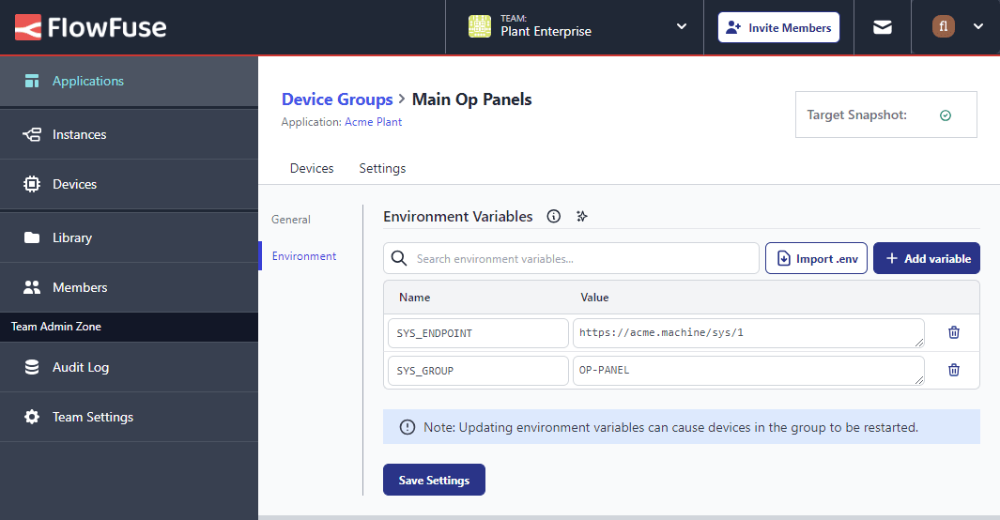

We have added the ability to set Environment Variables on a Device Group.
This allows you to set common values that all member devices can make use of.

{data-zoomable}
_Screenshot showing Device Group Environment Variables_

We hope this feature will make it easier to manage your devices and keep your configuration in one place.

See the [Device Group](https://flowfuse.com/docs/user/device-groups) documentation for more information on how to set environment variables for your device groups.
