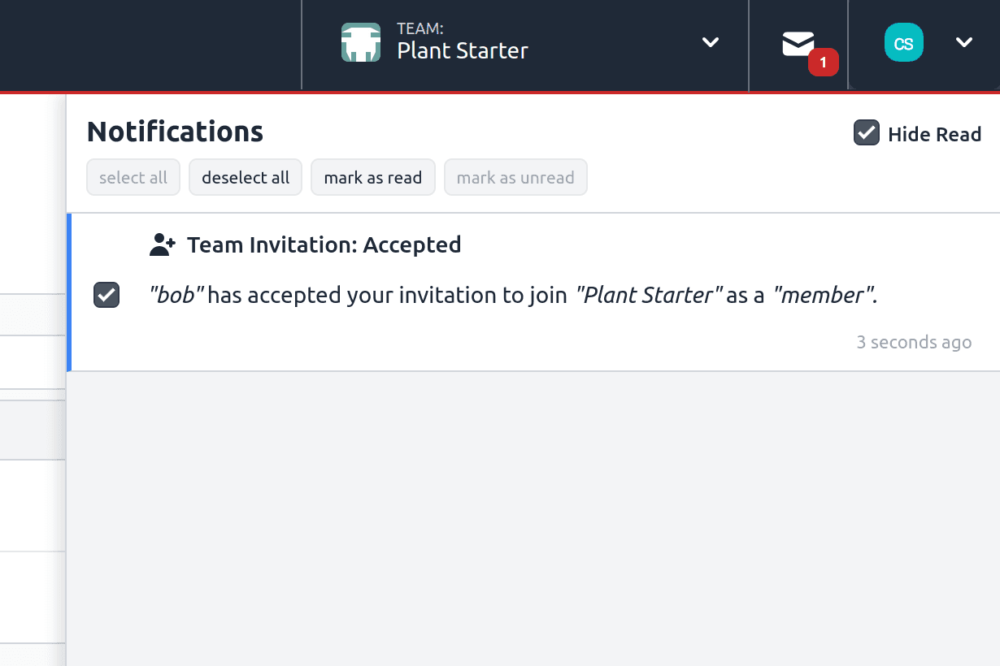

Starting with the v2.10.0 of FlowFuse, users have the ability to manage notifications in bulk, allowing users to select/deselect, mark as read, or mark as unread multiple notifications simultaneously.

