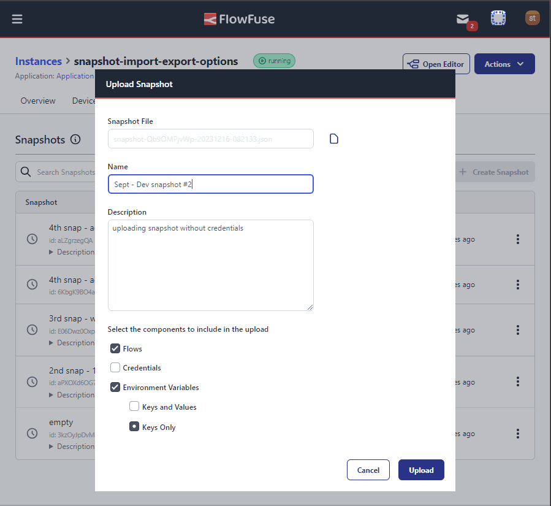

We have added the ability to select which components of a snapshot you want to keep when downloading or uploading a snapshot.

The options available are:
* Flows: Include the flows of the snapshot
* Credentials: Include the credentials of the snapshots flows
* Environment Variables
   * Keys and Values: Include the keys and values of the environment variables
   * Keys Only: Include only the keys of the environment variables

{data-zoomable}
_Screenshot showing snapshot download component options_

{data-zoomable}
_Screenshot showing snapshot upload component options_

This feature can help you be specific about what you want to include in a downloaded snapshot. This is especially useful when
you want to share a snapshot with others, but don't want to include sensitive information like credentials. Also,
when you receive a snapshot that needs importing into a different FlowFuse platform or team, you can can now be selective
about what to keep and what to exclude.

See the [Snapshots](https://flowfuse.com/docs/user/snapshots) documentation for more information.
