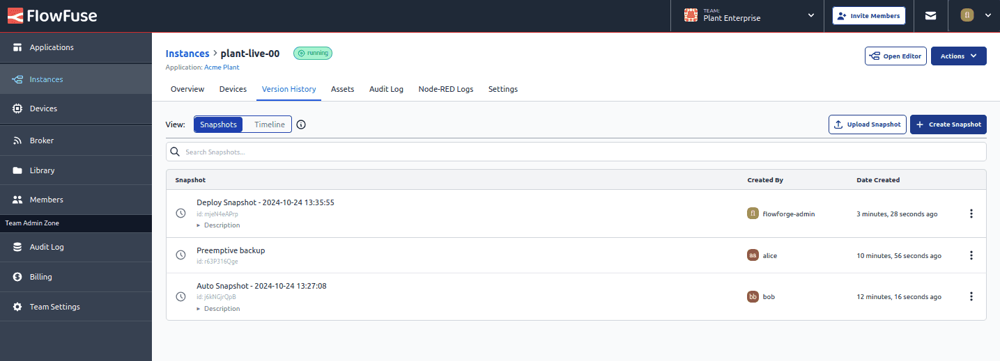

Instances can now make use of the new Timeline feature, providing a concise, chronological view of key activities within your Node-RED instance.

The Timeline tracks important events such as pipeline stage deployments, snapshot restorations, flow deployments, snapshot creations, and updates to instance settings, offering clear insight into when and what changes have been made.

The Timeline and Snapshots are now grouped together under the Version History tab, simplifying the navigation of your instance's history.

This feature is only available to Enterprise license and Cloud Team users. Note that the Timeline can only be accessed at the instance level.

{data-zoomable}
_Screenshot showing the new version history timeline_

{data-zoomable}
_Screenshot showing the relocated snapshot page under the version history tab_
