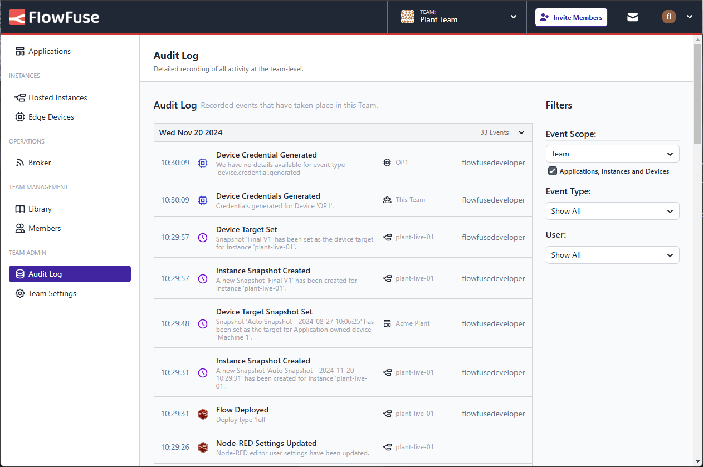

In FlowFuse V2.11, we have updated the Audit Log views to let you see more of the events happening within your team. Previously, the Audit Log view would only show you top-level events happening to the application or team. With this release, it now provides an aggregated view of all of your resources.
Additionally, each row contains an icon and name of the item raised the event that you can click to navigate straight to it making your workflow more streamlined.

_Screenshot showing Audit Log with hierarchical events_

We hope this feature will help you better understand and navigate your FlowFuse applications.