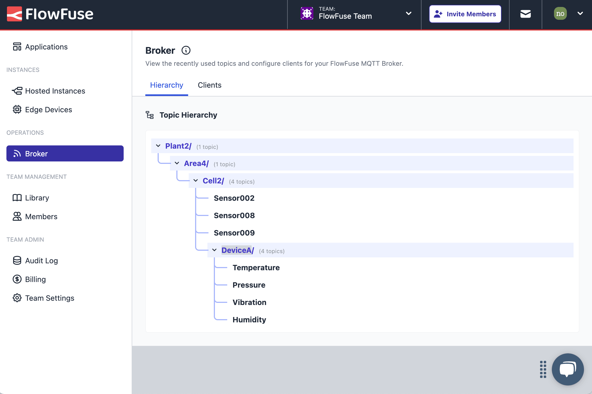

Having recently added [our very own MQTT Service](/blog/2024/10/announcement-mqtt-broker) to the platform, we're continuing to expand on the features and tools we provide to help teams build their solutions.

We have added a view that shows you what MQTT topics are being used on the Team Broker. This helps give you clarity on the structure of your topic-space, whether you're using the MQTT Broker for a unified namespace (UNS) or any other use case.

This is a small iteration of the feature but we'll have lots more to come.

{data-zoomable}
_Screenshot of the UI to explore your MQTT topic hierarchy_
