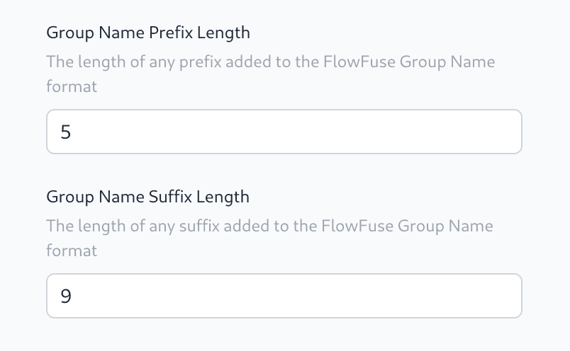

In order to support organisations that have strict SAML and LDAP Group name policies FlowFuse now allows a prefix and suffix length to be defined.

For example, if an organisation requires all groups to begin with `acme-org-`, a prefix length of `9` can be set and the group `acme-org-ff-development-owner` will be handled as `ff-development-owner`.

{data-zoomable}
_Screenshot of the prefix & suffix length_