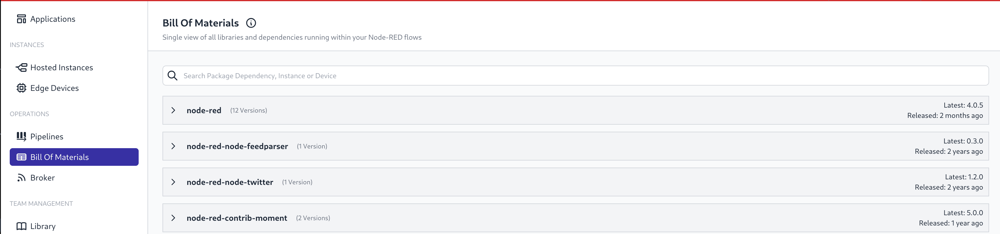
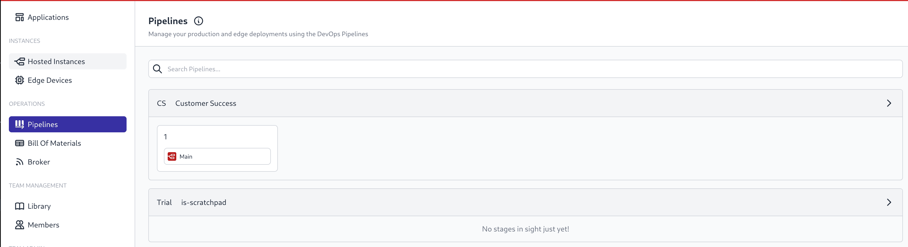

Team-level views of all Pipelines and Bill of Materials have been added to provide a complete overview.

The Bill of Materials view shows which components and their versions across all Node-RED Devices &  Instances in the whole Team rather than at an Application level.

{data-zoomable}
_Team BOM view_

Similarly the Team Pipeline view shows all CI delivery pipelines in all the Applications in the Team, giving team members a quicker way to jump to a specific Pipeline.

{data-zoomable}
_Team Pipelines_