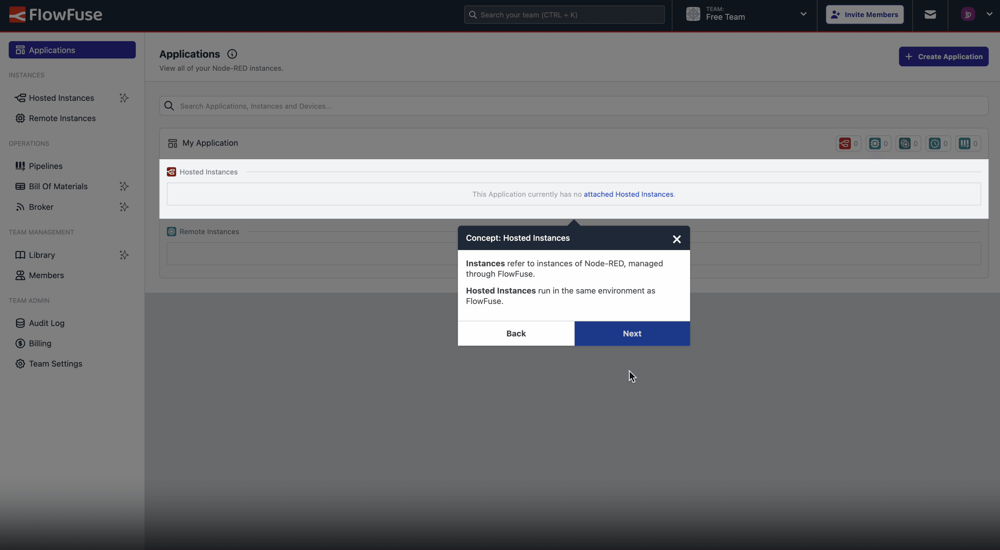

{data-zoomable}
_Screenshot from the new onboarding tour for "Free" tier FlowFuse Cloud users_

Following from our new "Free" tier on FlowFuse Cloud, we've also published a new onboarding tour to help users get started with their new team. 

This tour will guide you through the process of setting up your first Remote Instance, and show you how to access your Node-RED instance through FlowFuse Cloud, using the remote access tools.