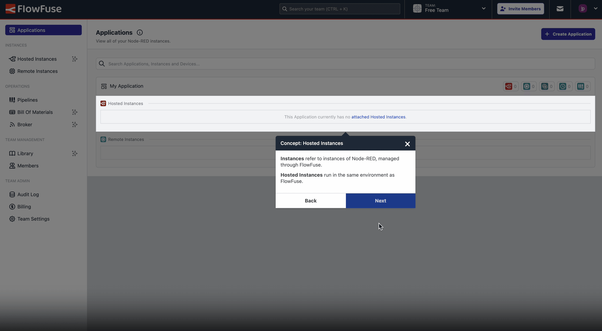

::note
Exciting Update! FlowFuse is now available as three different products: [FlowFuse Edge for OT teams](https://flowfuse.com/product/edge/), [FlowFuse Hub for IT teams](https://flowfuse.com/product/hub/), and [FlowFuse Fleet](https://flowfuse.com/product/fleet/) for managing devices at scale. Visit the [FlowFuse Product Page](https://flowfuse.com/product/) to learn how the platform enables you to build and manage industrial apps at scale.
::

{data-zoomable}
_Screenshot from the new onboarding tour for "Free" tier FlowFuse Cloud users_

Following from our new "Free" tier on FlowFuse Cloud, we've also published a new onboarding tour to help users get started with their new team. 

This tour will guide you through the process of setting up your first Remote Instance, and show you how to access your Node-RED instance through FlowFuse Cloud, using the remote access tools.
