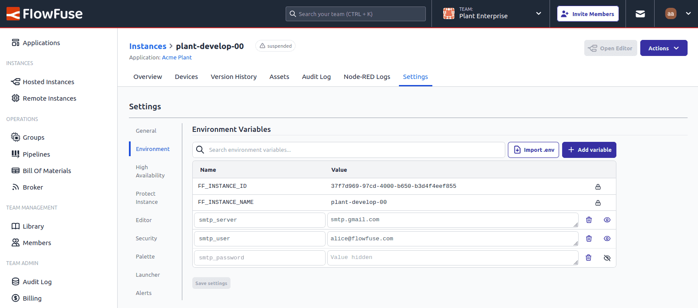
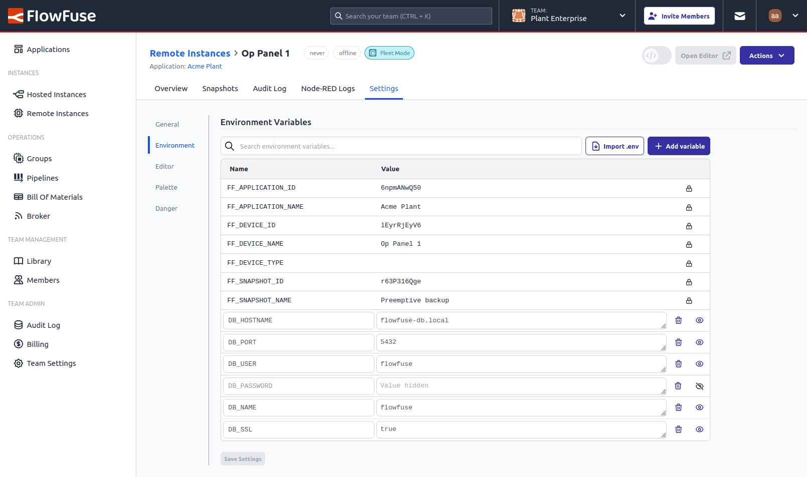

We’ve expanded the functionality of managing Node-RED environment variables by introducing the ability to hide their values in the UI.

### What’s new?
This feature is supported by both hosted and remote Node-RED instances.
- Users can now designate values as 'hidden' when creating or editing them.
- Hidden values are concealed in the UI for enhanced privacy and security.
- Once marked as hidden and saved:
    - the **name** cannot be changed.
    - the value can only be updated - its existing value cannot be seen.
- To make a value visible again, users must delete the entry and recreate it as a visible one.

This feature enhances security and allows for more control over sensitive configuration data, ensuring better management in your Node-RED workflows.

{data-zoomable}
_Screenshot of the new hidden environment variables feature - Hosted Instances_

{data-zoomable}
_Screenshot of the new hidden environment variables feature - Remote Instances_

