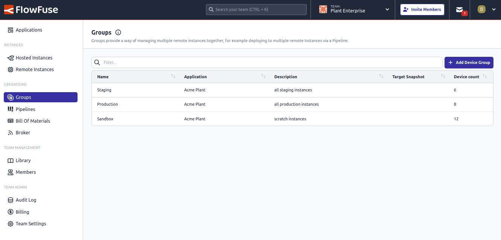

{data-zoomable}
_Screenshot from the new team level groups_

Managing remote instances is easier with the new Team-level view of Groups.

Groups let you organize your Remote Instances by application. They can then be used as a Target in DevOps pipelines for seamless updates across
multiple instances in one operation.

This simplifies deployments, enhances collaboration, and streamlines infrastructure management for faster, more
efficient workflows.

