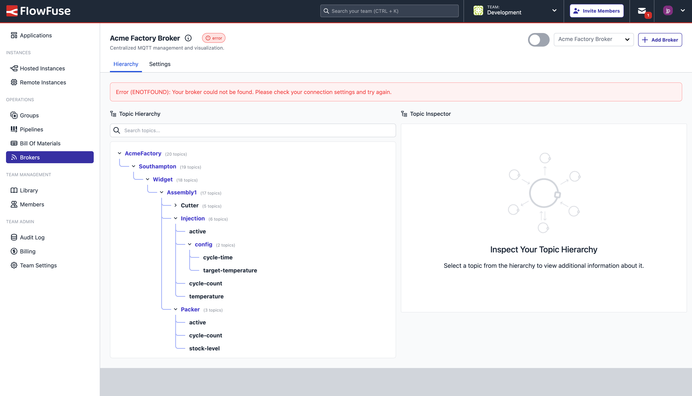

{data-zoomable}
_Improved feedback displayed to a user when a third-party broker does nto connect as expected_

We've improved the feedback displayed to a user when a third-party broker does not connect as expected. This will help users to diagnose and resolve issues with their broker connections more easily, extending on the "error" status pill that was initially implemented alongside the broker's name.