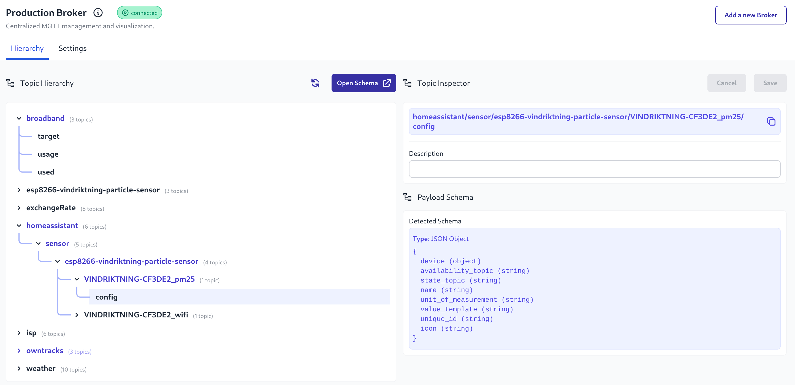

As part of the v2.14.0 release we are including support for gathering data from External MQTT brokers.

This includes topic structures similar to those gathered from the FlowFuse Team Broker.

{data-zoomable}
_Screenhot from creating new external broker_

As well as building a topic schema the message payloads will also be inspected to infer the format. Initially the payload schema supports JSON, but other payload formats may be added in future releases

{data-zoomable}
_Screenshot of topic and inferred payload schema_

This is available on FlowFuse Cloud and for Self Hosting users with an Enterprise License on Kubernetes and LocalFS, Docker support will follow shortly.