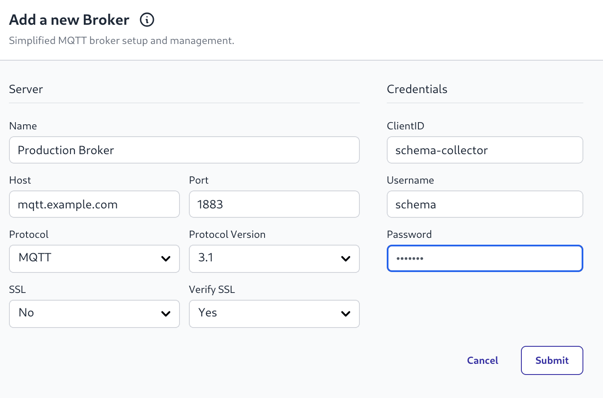

In a previous release, we introduced the FlowFuse Team Broker; an MQTT broker available to all instances running in your team. Whilst the Team Broker is a great addition, we are aware that many of our customers already have their own existing MQTT brokers and infrastructure.

We have now made it possible to connect the FlowFuse platform to your existing external MQTT broker. With that you'll get access to the same great features to help you gain a clear understanding of the activity on your broker, and the structure of the data and topics that are being used.

{data-zoomable}
_Screenhot from creating new external broker_

As well as building a topic schema, the message payloads will also be 
inspected to infer their format to help you understand your data.

{data-zoomable}
_Screenshot of topic and inferred payload schema_

Whilst connected, the FlowFuse platform will monitor the messages being published on the broker and update the information every few minutes. This means there will be a short delay between a message being published to a topic and that topic being shown in the hierarchy.

This is available on FlowFuse Cloud and for Self Hosting users with an Enterprise License on Kubernetes and LocalFS. Docker support will follow shortly.
