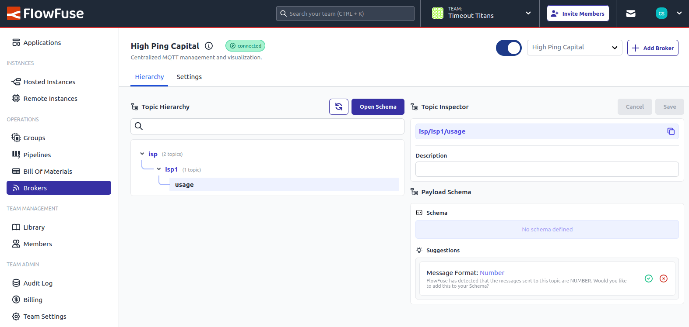

FlowFuse's new "Smart Suggestions" feature will help you get your full UNS and MQTT Broker documented with ease.

Our agent will monitor traffic through the Broker, and make calculate the schema of any payloads passed through. This assessment is turned into a "Suggestion" within the FlowFuse Platform, and can quickly be added to the formal schema for your Broker.

{data-zoomable}
