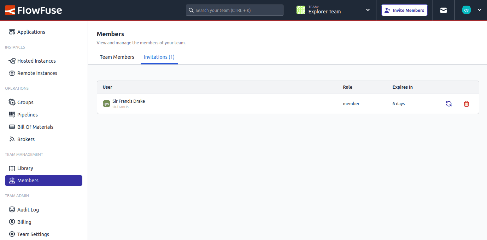

# Re-send Team Invitations and extend their expiration

We have added the ability to **re-send team invitations**, which also extends the expiration date of the invitation. This improvement ensures that invitations remain valid for a longer period and allows team administrators to easily re-invite users who may have missed their initial invitation.

This update enhances user management and simplifies the process of maintaining team memberships within FlowFuse.

{data-zoomable}
_Screenshot of the member invitation page_
