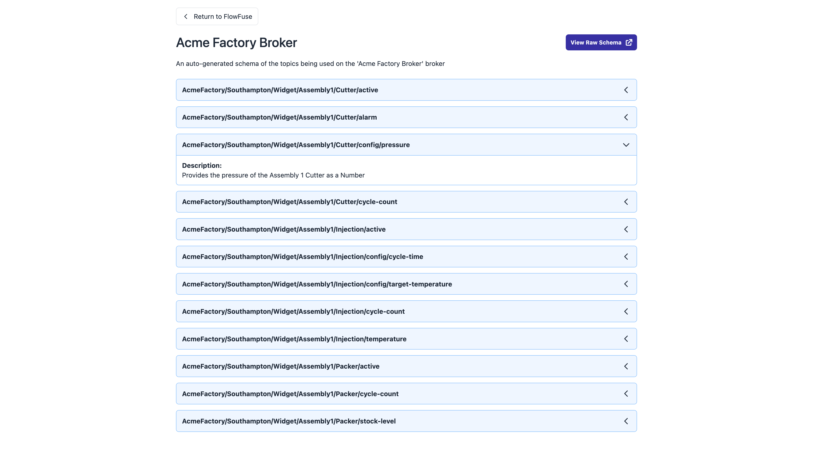

{data-zoomable}
_Screenshot of the new MQTT Broker schema documentation view available in FlowFuse_

This new view for your MQTT Broker focusses on clarity, and collaboration. It provides a single, easy to read window that provides the relevant information any member of your team or organization would need in order to understand what your MQTT broker is used for.

The underlying schema is generated automatically by FlowFuse, using the industry-standard, open-sourced, [AsyncAPI](https://www.asyncapi.com/), saving your months of resource in manually documenting payload and topic structures yourself.

The documentation provides a comprehensive view of the topics published to on your Broker, as well as crafted descriptions to help users understand each topic's purpose. This feature is available for both the in-built FlowFuse Broker, and any third-party broker that you choose to connect to.