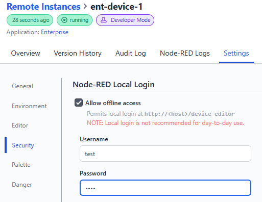

With the new 3.2.0 release of the FlowFuse Device Agent, we have introduced a new Local Login option for Remote Instances.

This feature allows you to enable a local login for your Remote Instance, which is particularly useful in air-gapped environments or times when the instance cannot reach the FlowFuse platform.

When local login is enabled, users can log in to Node-RED directly using the specified credentials.

For day-to-day activity, we still recommending accessing the editor through the FlowFuse Platform for the best user experience. However, for those times when that isn't possible, this option provides a fall-back to allow continued access to the device.

You can configure this option in your Remote Instance Settings tab under the Security section.
{data-zoomable}
_Screenshot of local login options_

Additionally, you can enable or disable local login for in the Device Agents YAML configuration file. For more information, refer to the (Node-RED Settings)[https://flowfuse.com/docs/device-agent/register/#node-red-settings] in our documentation.