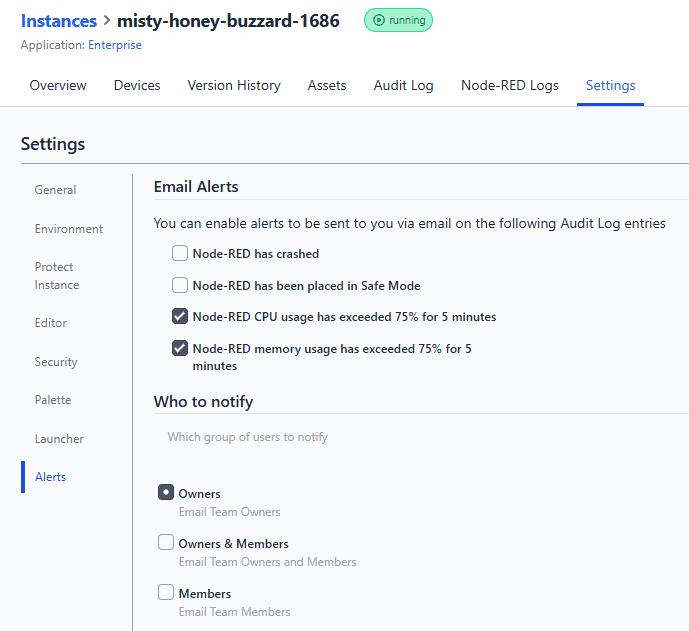

To help you manage resource utilization more effectively, we’ve introduced notifications to alert you when you’re nearing critical thresholds.

The new CPU and Memory notifications will notify you when usage exceeds 75% of capacity. This proactive alerting gives you the opportunity to take action before experiencing downtime or performance issues.

We hope this feature helps you avoid unexpected resource-related challenges with your applications.

{data-zoomable}
_Screenshot of the new resource notifications_

### How to Enable or Disable Notifications

You can manage these notifications in your Hosted Instance **Settings** tab under the **Alerts** section.

{data-zoomable}
_Screenshot of the new resource notifications settings_